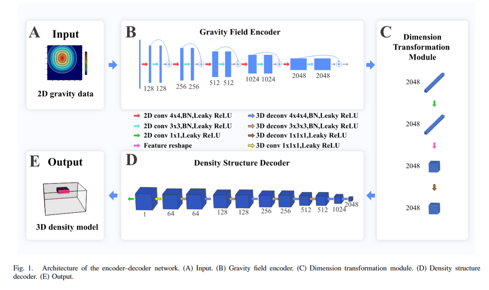

# Generative Exploration AI (GEAI)

## Background

Remote sensing of the subsurface is fundamentally ambiguous — many possible geological models can explain the same measurements.

**Gravity example:**
- **Forward problem:** Given a 3D density model → compute gravity field. Well-defined, computationally expensive but solvable.
- **Inverse problem:** Given gravity field → recover 3D density. Ill-posed: non-unique, unstable, underdetermined (2D → 3D).

**Industry approaches today:**
1. **Model → simulate → compare** — propose a geological model, forward simulate, compare with observed data, repeat.
2. **Direct inversion** — invert measurements into a model, often heavily regularized.

Both are used in conjunction, but service providers usually only deliver a model that fits the data — not one that's necessarily right or the most likely across the full solution space.

## Vision

Build an agent to drive end-to-end geophysical exploration — analogous to AlphaGo.

```
belief -> action -> possible observation -> plan -> measurement -> updated belief -> repeat
```

1. Generate geology
2. Suggest measurements (where most uncertain)
3. Take measurements (gravity, drill, mag, etc.)
4. Update geology
5. Repeat until satisfied

**Bayesian formulation:**
```
P(m|d) = P(m) * P(d|m)

New Belief = Old Belief * New Measurement Likelihood

m: structural geology
d: observations

P(m):   structural geology prior
P(d|m): likelihood of measurement given structural geology prior
P(m|d): structural geology given measurement
```

**Steps:**

1. Generate many samples of synthetic geology (Flow Matching, GANs)

2. Planning (MCTS or POMDP):
```
for candidate action a across all samples:
    simulate possible d ~ P(d|m, a)
        - predicted measurement value * each sample's voxel likelihood
    update belief
    evaluate downstream value
```

3. Choose highest expected value measurement (e.g., drill: angle, depth, x/y location)

4. Take a real measurement

5. Update belief via conditional generative geology

### Next Steps

1. Posterior Flow Sampling Implementation of Gravity & Conditional Flow Matching of Gravity
https://github.com/chipnbits/flowtrain_stochastic_interpolation

2. Confidence of each voxel (feature extent)
Feature extent & Model scoring: https://github.com/chipnbits/flowtrain_stochastic_interpolation

3. Planning (start with drilling): For a given block with a given uncertainty, determine best drill (angle, depth, (x,y) location)

### Infrastructure & Links

- [geai](https://github.com/Exascale-Systems/geai) — visualization, data generation, evaluation, forward modeling, UNet
- [Datasets & models](https://drive.google.com/file/d/1VrqcjQ8eliTs9gD75zIvI0jUpR37lg5K/view?usp=sharing) — Google Drive
- [StructuralGeo fork](https://github.com/kostubhagarwal/StructuralGeo) — realistic geology data generation
- [flowtrain_stochastic_interpolation](https://github.com/kostubhagarwal/flowtrain_stochastic_interpolation) — template for posterior flow sampling

---

## Objective

There are two technques for resolving a subsurface density map from surface gravity measurements. While, calculating the gravity from a known subsurface map is trivial, the inverse is an ill-posed problem without a unique solution.

## Inversion

Bayesian analysis techniques like [SIMPEG](https://docs.simpeg.xyz/latest/content/user-guide/tutorials/03-gravity/index.html) enable the resolution of  subsurface density contrasts.

Evaluation of the process requires the following:

Generate synthetic density contrast → Calculate gravity at surface → Add noise to surface gravity measurement (to simulate realistic survey) → Solve for density contrast using SIMPEG (L2 or IRLS inverse solvers).

Unfortunately this method is unsuitable for non-linear / sparse problems, struggles at long wavelengths, and is computationally expensive.

## Deep Learning

A forward pass through a neural net may be more suitable at resolving non-linear / sparse features such as those in subsurface density maps. Additionally, this is likely more computationally efficient. To generate a neural net of this kind, one has to train the weights of the neural net via deep learning to perform the inversion. Since there is limited subsurface density maps, one must use synthetic data. The training process requires the follwing:

Generate synthetic subsurface density map → Calculate gravity at surface → Add noise to surface gravity measurement (to simulate realistic survey) → Train neural net:

- gravity measurement (x)
- density contrast (y)

## Architecture (UNET 2D --> 3D)

Trying to replicate *Deep Learning for 3-D Inversion of Gravity Data* by *Zhang et al.*



## Dataset 1 [[single_block_v2.h5](data/single_block_v2.h5)]

- 20 000 samples
- 4:1 training, validation [[single_block_v2.npz](splits/single_block_v2.npz)]
- 0-1 g/cm^3
- 32 x 32 x 16 (50m voxels)
- Randomly generate 1 block 0-30% of domain size within voxel grid
- flat topography
- noise: 0.05e-3 mGal, w/ 95% confidence

## Dataset 2

The following paper describes a method for generating much more plausible/realistic synthetic geology. More specifically, applying matrix transformations to reflect realisitc geological timelines to an inital deposition of material. The variance in this dataset is a function of Markov sampling of the following [Markov Matrix](https://github.com/kostubhagarwal/StructuralGeo/blob/main/src/geogen/generation/markov_matrix/default_markov_matrix.csv).

[Synthetic Geology -- Structural Geology Meets Deep Learning](https://arxiv.org/abs/2506.11164)

The generation of this dataset relies on a [forked version](https://github.com/kostubhagarwal/StructuralGeo) of the repo described in this paper. This fork adds a channel of information (in this case density) to 'Rock Category Mapping' as defined in StructuralGeo via a lookup table.

## Repo

```
scripts/
  gen.py                entry point: generate dataset
  train.py              entry point: train the model
  eval.py               entry point: run evaluation

src/
  data/
    dataset.py          HDF5 streaming dataset, component extraction, normalization
    transforms.py       noise injection, norm/denorm

  gen/
    core.py             mesh, topography, random blocks, gravity survey (SimPEG)
    batch.py            batch generation — dataset 1 (random blocks)
    hdf5_writer.py      writes samples to HDF5
    structuralgeo/
      gen.py            StructuralGeo integration (realistic geology)
      batch.py          batch generation — dataset 2

  models/
    unet.py             GravInvNet — 2D→3D UNet

  train/
    engine.py           training loop, checkpointing, TensorBoard logging
    loss_functions.py   DiceLoss

  evaluation/
    pipeline.py         orchestrator: selects nn / bayesian / hybrid
    nn.py               NN evaluation + single-sample visualization
    hybrid.py           NN prediction as SimPEG initial model
    simpeg.py           pure Bayesian inversion (SimPEG)
    metrics.py          TorchMetrics, NumpyMetrics (RMSE, L1, IoU, Dice)
    plotter.py          gravity and density visualizations

params.yaml             all hyperparameters (data, gen, train, eval)
dvc.yaml                pipeline stage definitions
```

## Dependencies

- **[SimPEG](https://simpeg.xyz)** — forward modeling and inversion. Generates ground truth gravity data and serves as a physics-based regularizer in the hybrid eval pipeline.
- **[StructuralGeo](https://github.com/kostubhagarwal/StructuralGeo)** (forked) — realistic synthetic geology via Markov-sampled structural history. Installed from the fork via `uv`.
- **[DVC](https://dvc.org)** — tracks datasets, models, splits, checkpoints. Pipeline in `dvc.yaml`, parameters in `params.yaml`.
- **[TensorBoard](https://tensorboard.dev)** — loss curves, gradient norms, weight histograms.

## Setup

```sh
uv sync
```

Datasets and model checkpoints are not included in the repo. Download them from [Google Drive](https://drive.google.com/file/d/1VrqcjQ8eliTs9gD75zIvI0jUpR37lg5K/view?usp=sharing) and place `.h5` files in `data/` and `.pt` files in `checkpoints/`. Alternatively, regenerate from scratch with `dvc repro gen_data`.

---

## DVC

DVC tracks three pipeline stages: `gen_data → train → eval`. All hyperparameters live in `params.yaml`. DVC detects when params or dependencies change and only re-runs what's stale — it won't regenerate a 20K-sample dataset just because you tweaked `lr`.

### Run the full pipeline

```sh
dvc repro
```

### Run only one stage

```sh
dvc repro gen_data   # generate dataset only
dvc repro train      # train only (skips gen_data if data is unchanged)
dvc repro eval       # evaluate only (skips train if checkpoint is unchanged)
```

DVC checks each stage's dependencies first. If `data/single_block_v2.h5` already exists and `gen.*` params haven't changed, `dvc repro train` will skip gen_data entirely and go straight to training.

### Freeze a stage permanently

If you never want DVC to re-run data generation (e.g. dataset is fixed), freeze it:

```sh
dvc freeze gen_data     # dvc repro will always skip this stage
dvc unfreeze gen_data   # re-enable it
```

### Inspect results

```sh
dvc metrics show        # print all tracked metrics (train + eval JSON)
dvc params diff         # show what params changed since last run
dvc dag                 # visualize the pipeline graph
```

### Change an experiment

Edit `params.yaml` (e.g. change `train.model_name`, `train.lr`, `train.experiments`), then:

```sh
dvc repro train eval    # re-run only the affected stages
```

---

## TensorBoard

Training logs loss curves, gradient norms, weight histograms, and eval metrics in real time.

```sh
tensorboard --logdir=logs --bind_all
```

Open `http://localhost:6006` in your browser.

### What's logged

| Tab | What you see |
|---|---|
| **Scalars / Loss** | `Loss/train` and `Loss/val` per epoch |
| **Scalars / Metrics** | RMSE, L1, IoU, Dice on the validation set (logged every `eval_interval` epochs) |
| **Scalars / Hyperparams** | LR and weight decay (useful when using schedulers) |
| **Scalars / Gradients** | Gradient norm per batch — watch for spikes (exploding) or collapse to zero (vanishing) |
| **Histograms / Weights** | Weight distribution drift per layer per epoch — useful for detecting dead neurons or saturation |

### Typical healthy run

- `Loss/train` and `Loss/val` both decrease and track each other closely (no large gap = no overfitting)
- Gradient norm stays in the 0.01–1.0 range
- Weight histograms shift gradually without collapsing to zero

---

## To-do
#### High Priority
- Refactor ()
- Train & Evaluate (vector vs gz vs gzz vs gz & gzz vs vector & gzz)
- Train & Evaluate (dl vs dl+simpeg vs simpeg)
- train.py
    - loss function
        - MAE
        - dice
        - IoU
        - MSE (regression) & Dice/IoU (segmentation)
        - simpeg forward pass - compare true gravity to predicted gravity
    - data augmentation
        - rotation
        - flips
    - weight decay
    - learning Rate
    - batch size
    - normalization
- StructuralGeo dataset
------
#### Lower Priority
- nn.py
    - dropout
    - skip modules
    - attention
    - 3D --> 3D UNET?
    - multi-sensor fusion
        - ablation study
- generative modelling (Flow-matching & GANs)
- unstructured mesh??? https://www.youtube.com/watch?v=mvKNf_9CYTQ (geotexera)

## Completed
- inspect.py / plot.py
    - gravity
        - residual plot
            - RMSE
            - R^2
    - density map
        - mse vs l1 vs dice vs IoU
        - slice plot (x,y,z)
        - slice residuals plot (x,y,z)
            - mse vs l1 vs IoU vs dice coeff.
- train.py
    - track
        - gradient norms
        - weight histogram drift
        - *feature map visualization
- figure out gal/sqrt(Hz)
- heavy refactor
- SIMPEG eval.py
- consolidate/refactor metrics.py, eval.py, sample.py, data.py
- consolidate/refactor sample.py, eval.py
- refactor eval.py
- deeplearning + simpeg regularization hybrid
- Generate clean dataset with vector and grad components
- Train & Evaluate (0.5, 5, 50, 500 uGal nn)

## Open Questions
### Geology
- edge effects?
- synthetic data robustness?
- survey properties (spacing, noise)
- physics limitations (depth, feature size, etc)

### Deep Learning
- alternative architectures?
    - NeRF
    - DeepSDF
    - FNO / DeepONet
    - PINN

## Notes

#### Improved Gravity Inversion Method Based on Deep Learning with Physical Constraint and Its Application to the Airborne Gravity Data in East Antarctica
- CNN UNET (2D --> 3D)
- 20 000 samples
- 1g/cm^3 contrast
- 32 x 32 x 16 (1km cubes)

#### Deep Learning for 3-D Inversion of Gravity Data
- CNN UNET (2D --> 3D)
- 40 000 samples
- 0.1-1g/cm^3
- 3:1:1 ratio
- 64 x 64 x 32 (50m spacing)
- single block; single dipping slab; combined blocksl; combined dipping slabs

#### 3-D Gravity Inversion Based on Deep Convolution  Neural Networks
- CNN UNET (2D --> 3D Virtual (50 channels represent depth))
- 14 000 samples
- 3:1:1 ratio
- 112 x 112 x 50 channels (50m spacing)
- one, two, four prism

#### Three-dimensional gravity inversion  based on 3D U-Net++*
- CNN UNET (3D --> 3D)
- 12 000 samples
- 32 x 32 x 16
- 5:1 ratio
- difference from 3D UNET (plain skips vs dense/nested skips)

#### Three-Dimensional Gravity Inversion Based on Attention Feature Fusion
- CNN UNET (2D --> 3D)
- 32 x 32 x 16 (50m)
- 22 000 samples
- 1g/cm^3 density contrast

#### Mark McLean '3D inversion modelling of Full Spectrum FALCON® airborne gravity data over Otway Basin'
- https://www.youtube.com/watch?v=FwN9O1AnS3g&t=764s (mira & xcalibur)
    - terrain correction
    - dtu15 free-air satellite dataset
    - potential field models

## Resources

See [`resources/`](resources/) for collected research papers.
